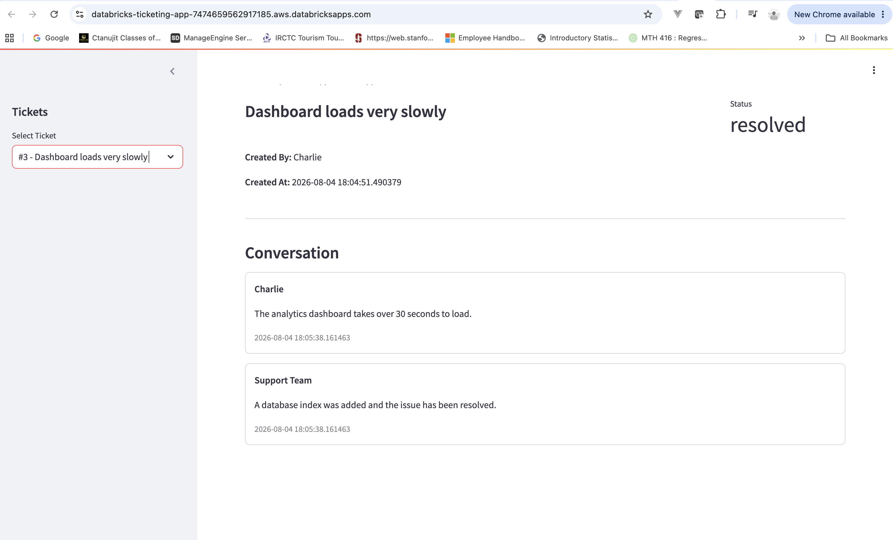

# databricks_bootcamp_ticketing_app
# 🎫 Lakebase Support Ticket System

A simple internal support ticket application built using **Databricks Apps**, **Streamlit**, and **Lakebase (Databricks-managed PostgreSQL)**.

This project was developed as part of the Databricks Lakebase Bootcamp to demonstrate how transactional application data can be stored and managed using Lakebase while building an interactive web application.

---

## Features

- View all support tickets
- View messages for a selected ticket
- Create new support tickets
- Add messages to existing tickets
- Update ticket status
- Store all operational data in Lakebase
- Secure database connection using Databricks Secret Scopes

---

## Technology Stack

| Component | Technology |
|----------|------------|
| Frontend | Streamlit |
| Backend | Python |
| Database | Lakebase (Databricks PostgreSQL) |
| Database Driver | psycopg2 |
| ORM / SQL Engine | SQLAlchemy |
| Deployment | Databricks Apps |
| Secret Management | Databricks Secret Scope |
| Version Control | GitHub |

---

## 📂 Project Structure

```
databricks-ticketing-app/
│
├── app.py                # Streamlit application
├── lakebase.py           # Database connection and helper functions
├── app.yml               # Databricks App configuration
├── requirements.txt      # Python dependencies
├── README.md
└── LICENSE
```

---

## 🗄️ Database Schema

### tickets

| Column | Description |
|---------|-------------|
| ticket_id | Primary Key |
| title | Ticket title |
| status | Current ticket status |
| created_by | Ticket creator |
| created_at | Creation timestamp |

### ticket_messages

| Column | Description |
|---------|-------------|
| message_id | Primary Key |
| ticket_id | Foreign key to tickets |
| message_text | Support message |
| author | Message author |
| created_at | Message timestamp |

---

## Database Connection

The application connects securely to Lakebase using a Databricks Secret Scope.

The Lakebase PostgreSQL connection URL is stored as a secret and retrieved at runtime, ensuring that credentials are never stored in the source code.

---

## ▶️ Running the Application

Install dependencies:

```bash
pip install -r requirements.txt
```

Run the Streamlit application:

```bash
streamlit run app.py
```

For deployment, the application is configured using Databricks Apps through the `app.yml` configuration file.

---

## 📸 Screenshots

### Application



### Lakebase Tables


---

## Future Improvements

- Ticket priority (High, Medium, Low)
- Ticket categories
- Search and filtering
- Dashboard with ticket statistics
- Delete tickets with confirmation
- User authentication
- AI-powered ticket summarization and response suggestions


## 👤 Author

**Manan Shah**

Databricks Lakebase Bootcamp Project