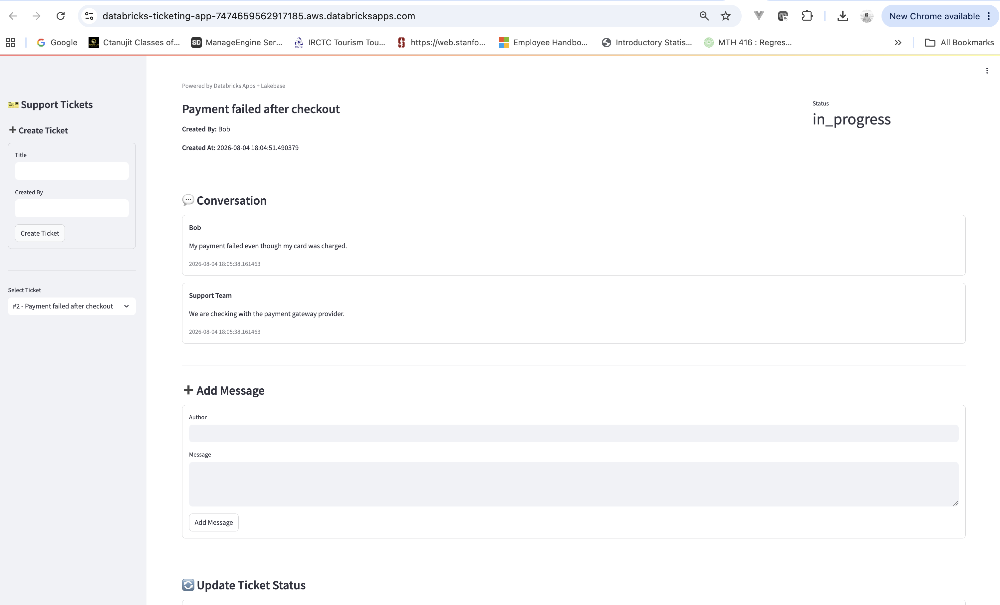
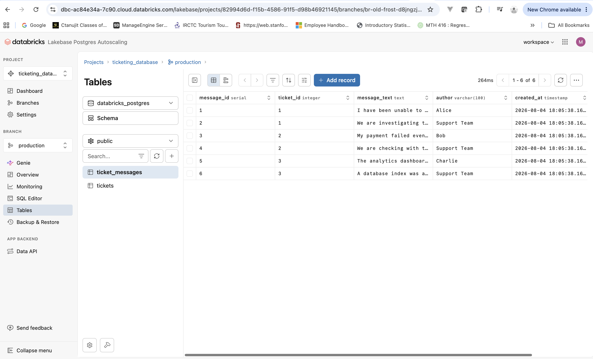

# 🎫 Lakebase Support Ticket System

A simple internal support ticket management application built using **Databricks Apps**, **Streamlit**, and **Lakebase (Databricks-managed PostgreSQL)**.

This project was developed as part of the **Databricks Lakebase Bootcamp** to demonstrate how operational applications can leverage Lakebase as a transactional database while being deployed entirely within the Databricks ecosystem.

---

## 🚀 Features

- 📋 View all support tickets
- 🔍 Select a ticket and view its conversation history
- ➕ Create new support tickets
- 💬 Add messages to existing tickets
- 🔄 Update ticket status (Open, In Progress, Resolved)
- 💾 Store all operational data in Lakebase
- 🔐 Secure database connection using Databricks Secret Scopes

---

## 🛠️ Technology Stack

| Component | Technology |
|-----------|------------|
| Frontend | Streamlit |
| Backend | Python |
| Database | Lakebase (Databricks PostgreSQL) |
| Database Driver | psycopg2 |
| SQL Engine | SQLAlchemy |
| Deployment | Databricks Apps |
| Secret Management | Databricks Secret Scopes |
| Version Control | Git & GitHub |

---

## 📂 Project Structure

```text
databricks-ticketing-app/
│
├── app.py                # Streamlit application
├── services.py           # Business logic and CRUD operations
├── lakebase.py           # Database connection and query helpers
├── app.yml               # Databricks App configuration
├── requirements.txt      # Python dependencies
├── README.md
└── LICENSE
```

---

## 🗄️ Database Schema

### tickets

| Column | Description |
|---------|-------------|
| ticket_id | Primary Key |
| title | Support ticket title |
| status | Ticket status (open, in_progress, resolved) |
| created_by | User who created the ticket |
| created_at | Timestamp when the ticket was created |

---

### ticket_messages

| Column | Description |
|---------|-------------|
| message_id | Primary Key |
| ticket_id | Foreign Key referencing `tickets.ticket_id` |
| message_text | Message content |
| author | Author of the message |
| created_at | Timestamp when the message was added |

---

## 🔐 Database Connection

The application securely connects to Lakebase using a **Databricks Secret Scope**.

The PostgreSQL connection URL is stored as a secret and retrieved securely at runtime. No credentials are stored in the source code or committed to the repository.

---

## ▶️ Running the Application

### Install dependencies

```bash
pip install -r requirements.txt
```

### Start the Streamlit application

```bash
streamlit run app.py
```

For deployment, the application is configured using **Databricks Apps** through the `app.yml` configuration file.

---

## 📸 Application Preview

### Support Ticket Dashboard



---

### Lakebase Tables



---

## 🎯 Future Enhancements

Some additional features that could be added include:

- Ticket priority (High, Medium, Low)
- Ticket categories
- Search and filtering by status
- Dashboard with ticket statistics
- Delete ticket functionality with confirmation
- User authentication and authorization
- File attachments for support tickets
- AI-powered ticket summarization and response suggestions using Databricks AI

---

## 👤 Author

**Manan Shah**

Databricks Lakebase Bootcamp Project